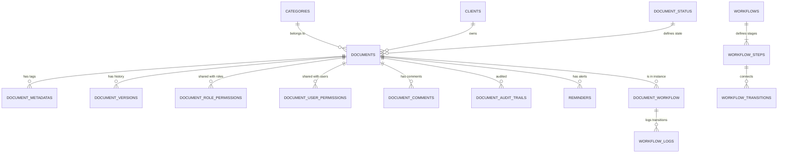

# Forensic Analysis: Database Schema Consolidation

This document lists all tables within the Documents ecosystem and maps their relationships.

## 1. Core Document Tables

| Table Name | Description | Key Relationships |
| :--- | :--- | :--- |
| **documents** | Central document repository | Category, User (Creator), Client, Status, Workflow Instance |
| **categories** | Hierarchical folder structure | Parent Category, Documents |
| **documentMetaDatas** | Searchable tags for documents | Document |
| **documentVersions** | File versioning and history | Document |
| **documentStatus** | Lifecycle states (Draft, Published, etc) | Documents |
| **clients** | Client/Company mapping | Documents |

## 2. Permissions & Access Control

| Table Name | Description | Key Relationships |
| :--- | :--- | :--- |
| **documentRolePermissions** | Role-based document access | Document, Role |
| **documentUserPermissions** | User-specific document access | Document, User |
| **document_shareable_link** | Public links for document sharing | Document |

## 3. Engagement & Logs

| Table Name | Description | Key Relationships |
| :--- | :--- | :--- |
| **documentComments** | Threaded comments on documents | Document, User |
| **documentAuditTrails** | Operations history | Document, User, Role |
| **reminders** | Date-based alerts for documents | Document, User |
| **user_notifications** | App-level alerts for users | Document, User |

## 4. Workflow Tables (Advanced Lifecycle)

| Table Name | Description | Key Relationships |
| :--- | :--- | :--- |
| **workflows** | Workflow process definitions | User (Creator/Modifier) |
| **workflowSteps** | Individual stages (e.g., "Review") | Workflow |
| **workflowTransitions** | Paths between steps | Workflow, Step (From/To) |
| **workflowTransitionUsers** | User-specific auth for transition | Transition, User |
| **workflowTransitionRoles** | Role-specific auth for transition | Transition, Role |
| **documentWorkflow** | Active workflow instance on a document| Document, Workflow, Current Step |
| **workflowLogs** | History of workflow movements | Document Workflow, Transition, User |

---

## 5. ERD Logic (Simplified)

## 6. Migration Key Indices
- **Primary Keys**: All tables use `UUID` (`id`) as the primary key.
- **Foreign Keys**: Enforced on `categoryId`, `createdBy`, `parentId`, `documentId`, `workflowId`.
- **Performance Note**: Materialized paths (like `hierarchyPath`) are currently managed manually via SQL scripts or application logic rather than original schema triggers.
