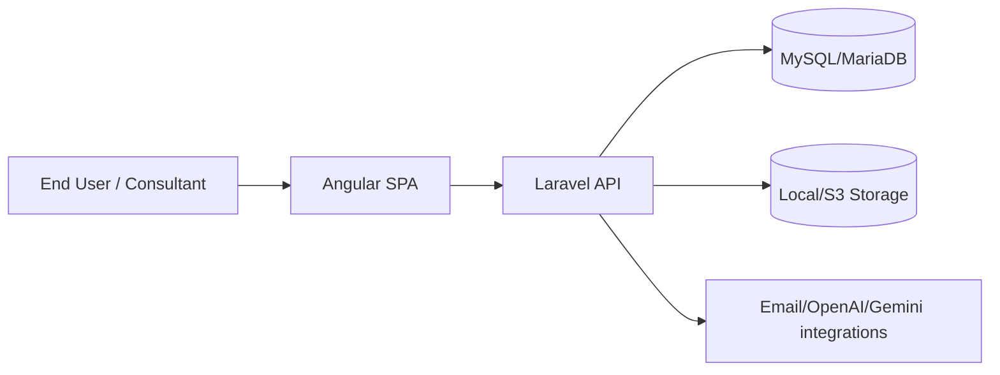
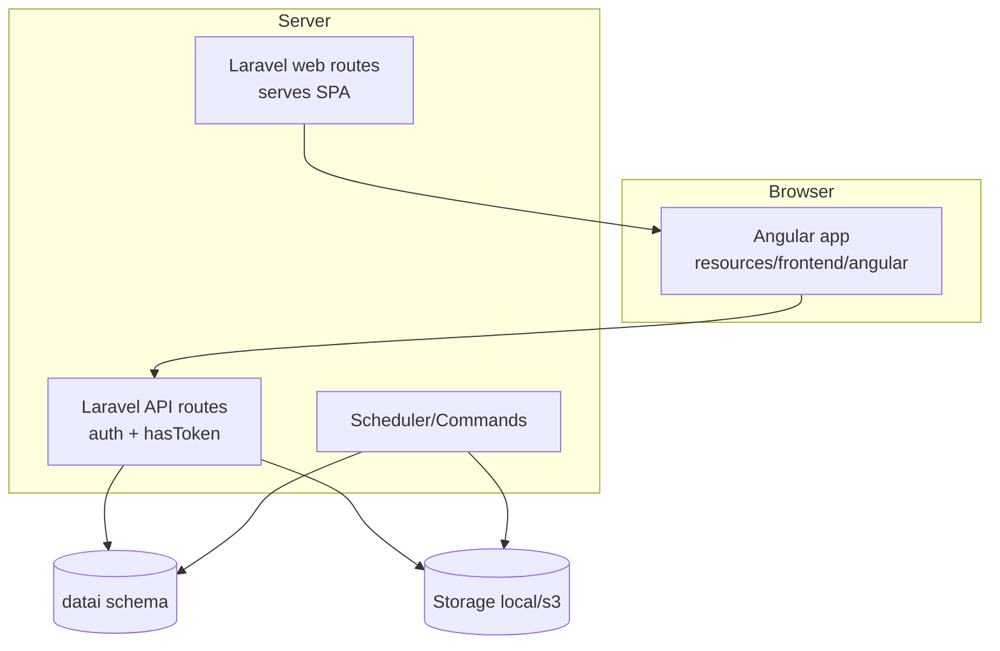

# C4 Forensics (Mermaid)

## System Context


## Container Diagram


## Component Diagram: Documents module
```mermaid
flowchart LR
  DL[DocumentListComponent\nDocumentLibraryListComponent] --> DS[DocumentService / DocumentLibraryService]
  DS --> AR[/api/documents, /api/document/*]
  AR --> DC[DocumentController]
  AR --> DPC[DocumentPermissionController]
  AR --> DVC[DocumentVersionController]
  AR --> DWC[DocumentWatermarkController]
  DC --> DR[DocumentRepository]
  DPC --> DPR[DocumentPermissionRepository]
  DVC --> DVR[DocumentVersionsRepository]
  DR --> T1[(documents, permissions, comments, versions)]
```

## Component Diagram: Auth/RBAC
```mermaid
flowchart LR
  Login[LoginComponent] --> Sec[SecurityService]
  Sec --> AuthAPI[/api/auth/login,/api/auth/refresh]
  AuthAPI --> AC[AuthController]
  AC --> RC[(userRoles, roleClaims, userClaims)]
  APIReq[any protected api request] --> HT[HasToken middleware]
  HT --> JWT[(claims in JWT payload)]
  Route[Angular route + menu] --> AG[AuthGuard + hasClaim directive]
  AG --> JWT
```
